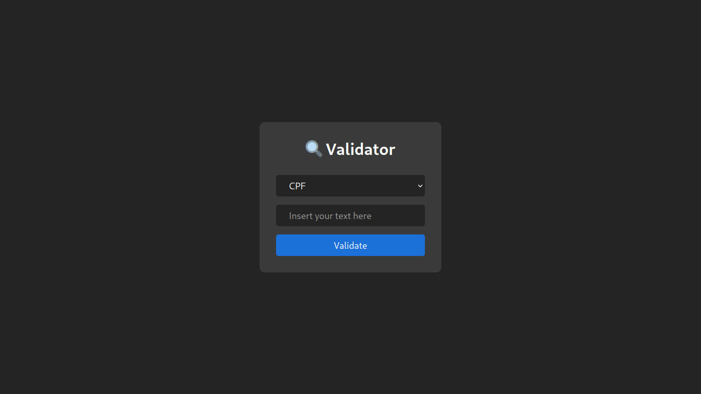

# Project Validator

[](https://opensource.org/licenses/ISC)

## Link

## [validator.vercel](https://paulo-validator.vercel.app/)

## Preview



## About

This is my 11th project during my journey at Trybe!

Using [Vite](https://vitejs.dev/) and the [Validator](https://www.npmjs.com/package/validator) library, users can validate various types of data through a simple and intuitive interface. The purpose is to practice using external libraries and engage with their documentation

## How to Use

### Clone the Repository

```bash
git clone git@github.com:opaulojr/validator.git && cd validator
```

### Install Dependencies

```bash
npm install
```

### Run the Project

```bash
npm run dev
```

## Repository Structure

- The `src` folder contains all the code

## Implemented Features

### Data Validation

  - There is a selection button where the user chooses the type of input they want to validate.
  - Below the button, there is a field for the user to enter the data to be validated.
  - After choosing the data type and entering it, the user must click the **'Validate'** button. If the data entered in the field matches the data type chosen in the select, the text **'True'** is displayed. Otherwise, the text **'FALSE'** is displayed

---

### Validator Library

  - Through functions and regular expressions, this library can validate different types of data such as email, URLs, Hex Color, etc. But not only that, it can also be used to normalize and/or sanitize data! For more information, visit its [documentation](https://www.npmjs.com/package/validator)

---
